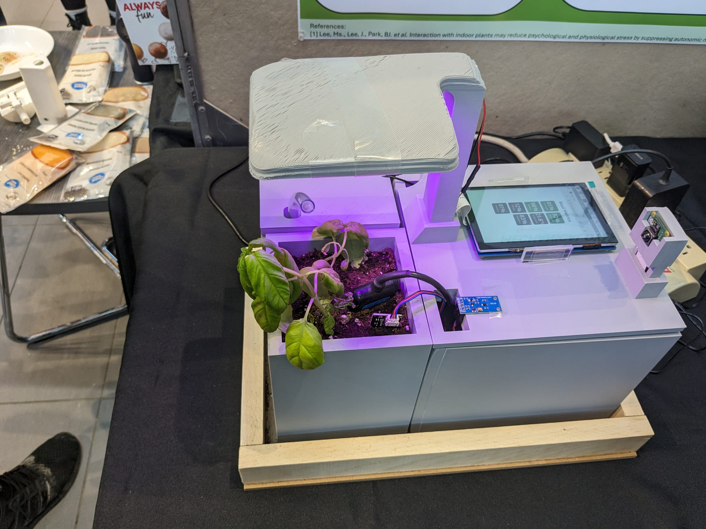
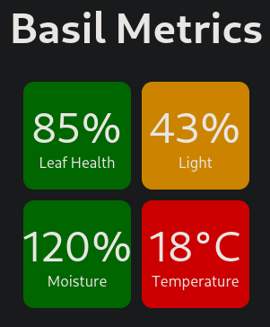
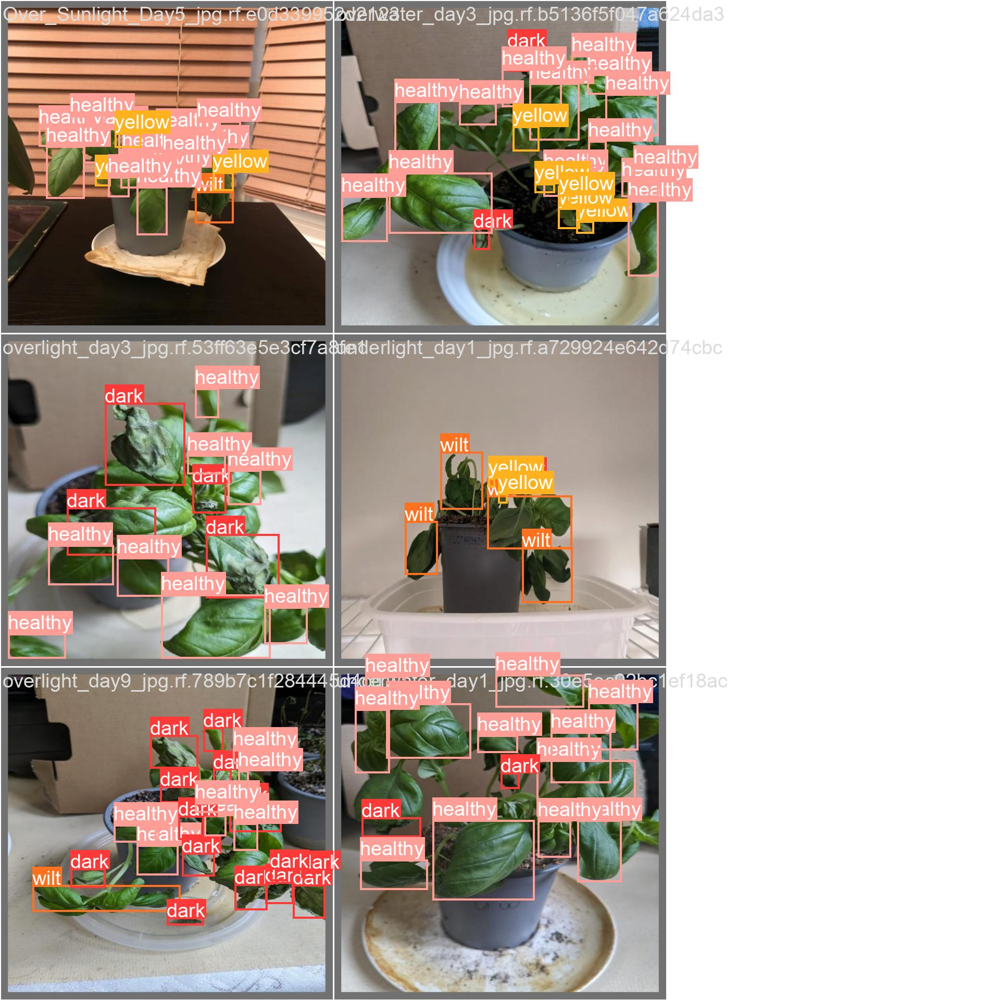

# basil-grower-capstone

Welcome to my Fourth Year Design Project (FYDP) which I completed to graduate from Mechatronics Engineering at University of Waterloo. The basil grower utilizes machine learning to classify leaf health. The quantified leaf health can modify the amount of water and light which are autonmously provided. Over time, the basil grower learns perfect growing conditions for basil to keep it in perfect health. All infrastructure is deployed on GCP, using Docker images.

## Sub-Directories Explained
- train_ml_model_yolo is the scripts and dataset used to train a yolov8 model. A set of homegrown basil plants were grown and photographed to train the model. The 4 trained classes are healthy, yellow, dark, and wilt.
- rate_plant_health_flask is a flask app which hosts the trained model's weights. The web app intakes an image, runs leaf classification, then returns the health of each leaf over. Demo [here](https://rate-app-image-ro735h6uvq-pd.a.run.app/upload/).
- show_pot_metrics is the web app which shows sensor data, and overall plant health on the pot. Its deployed publicly so users can view their pots metrics remotely. The backend was built with Flask, and the frontend was built with React. Demo [here](https://show-frontend-ro735h6uvq-pd.a.run.app/).
- raspberry_pi_code_snippets are examples of code used to interface with the web apps, and database. These were utilized by the firmware engineer to interact with cloud infrastructure. 
- offline frontend was a failover version if the basil grower loses internet connectivity, and can utilize local sensor data to drive the disply.

Additional information, such as how to installation steps, and examples of plant health classification in action, is included in each sub-directory. 

## Frontend 

## Leaf Health Classification

## Other
The differing dependicies of each sub-project was handled effortlessly with nix-shell to define each dev-environment, and direnv to handle loading into each environment when entering or leaving each sub-directory.

Big thanks to my 3 other team members who worked mechanical, electrical, and firmware componenets.