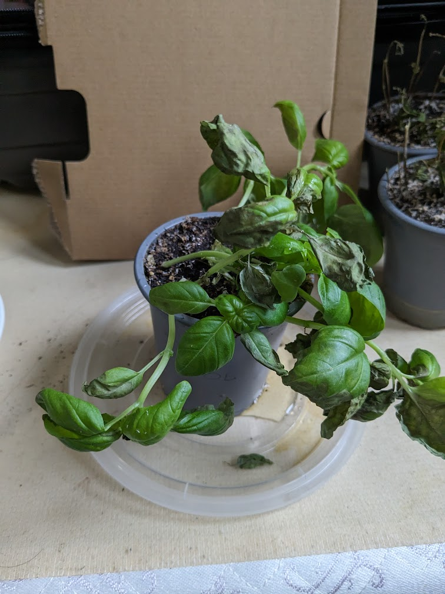
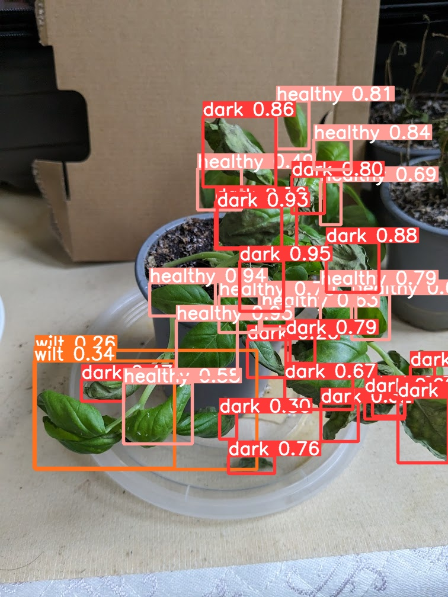

# About
This project utilizes a trained model from my other [project](https://github.com/j-taylor-pixel/plant_health_detection) where I grew and tagged over 500 leafs to train a YOLOv8 object detection model to identify different leaf health.

A flask app is created that accepts an image of a plant like below:

And runs the pre-trained model on it to detect leaf health.

The model will return an array of detected leaf states `['dark', 'wilt', 'healthy']`

This was built as a component of my 4th year capstone project, which is a plant pot which utilizes ML to provide ideal amounts of water and sunlight based on sensory feedback and visual leaf health.

A demo is availible at https://rate-app-image-ro735h6uvq-pd.a.run.app/upload/
Try uploading a basil photo, and see the detected leaf states.

# Installation
`pip install -r requirements.txt`

if os error no space, try: 

`TMPDIR=/home/josiah/tmp/ pip install -r requirements.txt`

opencv-python is installed by default, but it has dependency errors

`pip install opencv-python-headless`

# How to run

`python -m flask run`

Alterntively:

`docker build . -t rate_app`

`docker run -p 5000:5000 rate_app`

A popup should appear prompting a [link](http://127.0.0.1:5000/) to open the app in a browser window
